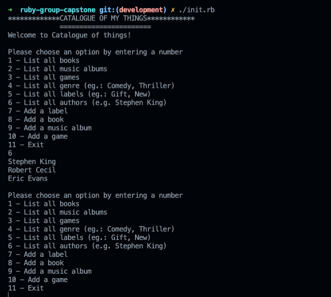

# ruby-group-capstone
> ruby-group-capstone is a command line App that lets you add an item which can be a book, game, or music album. 
## Built With

- Ruby
- Rspec
## Video Presentation
[Click to watch](https://drive.google.com/file/d/1iVRkaIM0PLuBlcVZb3Zd9sPmZot-Ffx7/view?usp=sharing)

## Screenshot

## Getting Started

To get a local copy up and running follow these simple example steps.

Clone the project by using terminal:

```
git clone https://github.com/nevisende/ruby-group-capstone.git
cd ruby-group-capstone
./init.rb
```
- To run test 
  `rspec`


### Install

Not required

## Authors

👤 **Furkan Denizhan**

- GitHub: [nevisende](https://github.com/nevisende)
- Twitter: [nevisen_de](https://twitter.com/nevisen_de)
- LinkedIn: [furkan-denizhan](https://www.linkedin.com/in/furkan-denizhan)

👤 **Azeem Olatunji**

- GitHub: [zemola](https://github.com/zemola)
- Twitter: [@zemolat](https://twitter.com/zemolat)
- LinkedIn: [olatunjiazeem]([https://www.linkedin.com/in/olatunjiazeem)

👤 **ANNAH TUMWOROBERE**

- GitHub: [Tumworobere](https://github.com/Tumworobere)
- Twitter: [@twitterhandle](https://twitter.com/Tannah2090)
- LinkedIn: [annah-tumworobere](https://linkedin.com/in/annah-tumworobere)

## Show your support

Give a ⭐️ if you like this project!